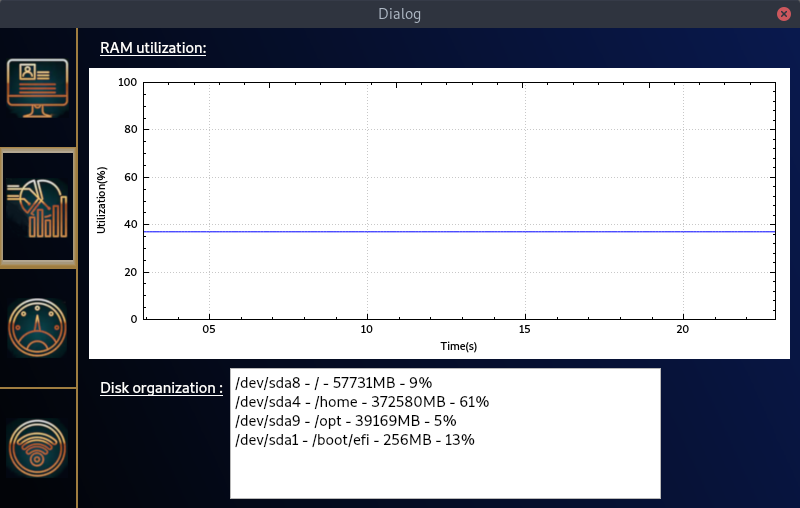
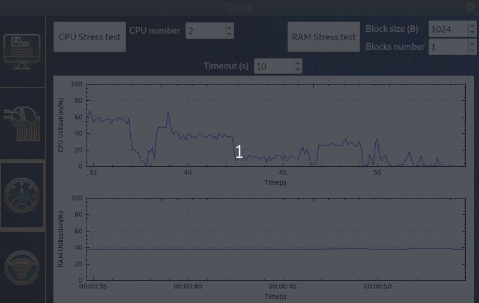
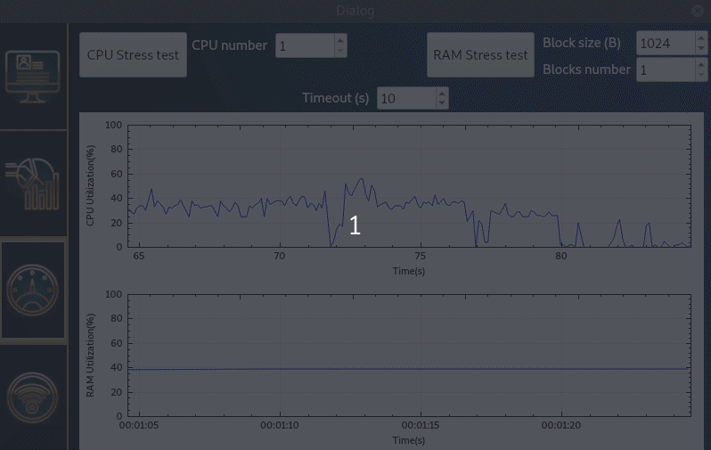

# INTRODUCTION

Qt5 application made for Raspberry official Touchscreen 7".  
The application displays general information about the target, monitoring graph (cpu and ram) and network information.  
*Remark : the application can be launched on Linux desktop too*  









# DEPENDENCIES

1. Install IDE QtCreator
````
sudo apt install qtcreator
````

2. Install Qt5 : https://wiki.qt.io/Install_Qt_5_on_Ubuntu

3. Install packages dependencies
````
sudo apt install libqwt-qt5-dev libqt5charts5 libqt5charts5-dev libqt5quickcontrols2-5 libqt5quickwidgets5 libqt5svg5 libqt5svg5-dev libqt5widgets5 libqt5core5a qtdeclarative5-dev libgles2-mesa-devqtquickcontrols2-5-dev qtquickcontrols2-5-dev libqt5quick5
````


# REFERENCES

- RadialBar QML modified :
https://github.com/arunpkqt/RadialBarDemo

- read FS modified :
https://github.com/perusio/linux-programming-by-example/blob/master/book/ch08/ch08-statvfs.c


# USEFUL LINKS

- read target information : cpu, ram, net, time ...
https://makerdyne.com/2014/03/09/reading-linux-system-info-with-c/

- https://medium.com/@primaadipradana/stress-test-cpu-and-memory-in-linux-d17bfa5e8887


